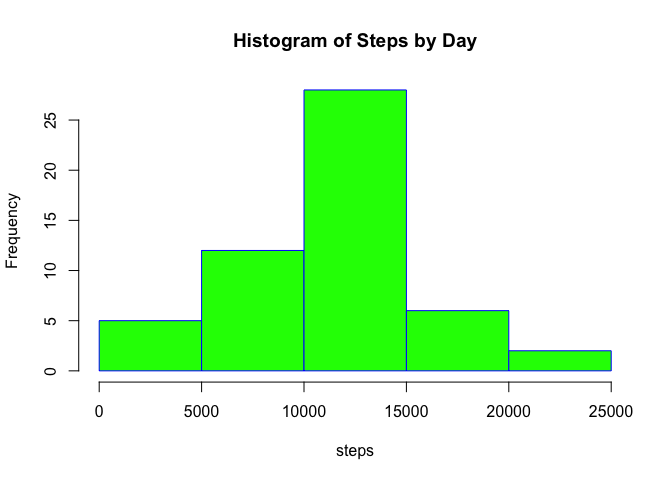
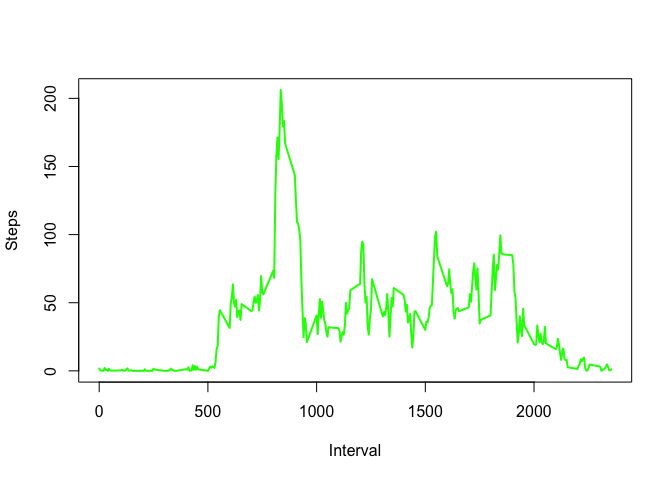
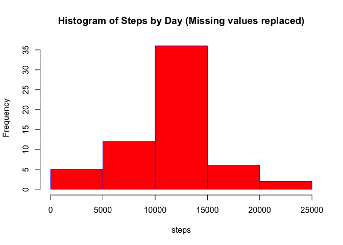
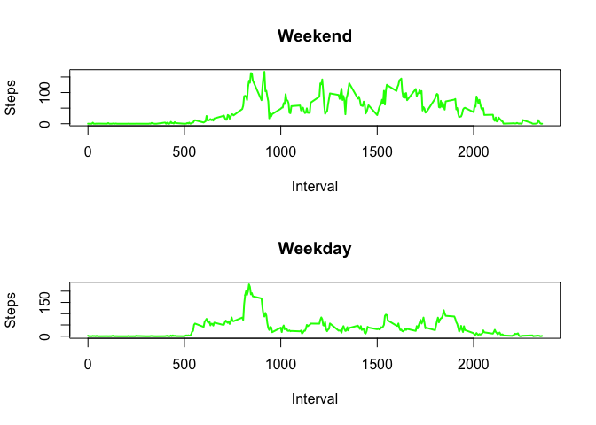

## Loading and preprocessing the data
In order to load activity data the working directory is set to the repository directory to unzip activity.zip file  


```r
knitr::opts_knit$set(root.dir = getwd())
unzip("activity.zip")
```
Load data

```r
dtActivity<-read.csv("activity.csv",header = TRUE,sep = ",")
```
There is no preprocessing data.

## What is mean total number of steps taken per day?
1. Calculate the total number of steps taken per day  

```r
dtStepsByDay<-aggregate(steps ~ date,dtActivity,sum)
```
2. Plot an histogram of the total number of steps taken each day  

```r
hist(dtStepsByDay$steps,main="Histogram of Steps by Day", xlab = "steps", border = "blue",col="green")
```

<!-- -->

The image is saved to figure directory.

```r
dev.copy(png,"figure/f1.png")
dev.off()
```
3. Calculate and report the mean and median of the total number of steps taken per day  

```r
mean(dtStepsByDay$steps)
```

```
## [1] 10766.19
```

```r
median(dtStepsByDay$steps)
```

```
## [1] 10765
```

## What is the average daily activity pattern?
1.Make a time series plot of the 5-minute interval (x-axis) and the average number of steps taken, averaged across all days (y-axis)  

```r
dtActivity5Interval <- aggregate(steps ~ interval,dtActivity,mean)
plot(dtActivity5Interval$interval, dtActivity5Interval$steps, type="l", xlab="Interval", ylab="Steps", col="green" , lwd=2)
```

<!-- -->

The image is saved to figure directory.

```r
dev.copy(png,"figure/f2.png")
dev.off()
```
  
2. Which 5-minute interval, on average across all the days in the dataset, contains the maximum number of steps?

```r
dtActivity5Interval[dtActivity5Interval$steps==max(dtActivity5Interval$steps),]$interval
```

```
## [1] 835
```

## Imputing missing values
1. Calculate and report the total number of missing values in the dataset (i.e. the total number of rows with NAs)  

```r
nrow(dtActivity[is.na(dtActivity$steps),])
```

```
## [1] 2304
```

2. Devise a strategy for filling in all of the missing values in the dataset. The strategy does not need to be sophisticated.  
The strategy to fill in all the missing values in the dataset is described as follows:  
- Create a dataframe of records with missing values  
- Calculate mean value per interval  
- Substitute missing values with mean value per interval  


```r
objMissingValues <-is.na(dtActivity$steps)
dtActivityMissingValues <- dtActivity[objMissingValues,]
dtStepsByInterval<-aggregate(steps  ~ interval,dtActivity,mean)
dtActivityNAR<-merge(dtActivityMissingValues,dtStepsByInterval, by.x = "interval", by.y = "interval")
dtActivityNew<-data.frame("steps"=dtActivityNAR$steps.y,"date"=dtActivityNAR$date,"interval"=dtActivityNAR$interval)
```

3. Create a new dataset that is equal to the original dataset but with the missing data filled in.  


```r
dtActivity2<-rbind(dtActivityNew,dtActivity[!objMissingValues,])
```

4. Make a histogram of the total number of steps taken each day


```r
dtActivity2StepsByDay <-aggregate(steps ~ date,dtActivity2,sum)
hist(dtActivity2StepsByDay$steps,main="Histogram of Steps by Day (Missing values replaced)", xlab = "steps", border = "blue",col="red")
```

<!-- -->

The image is saved to figure directory.

```r
dev.copy(png,"figure/f3.png")
dev.off()
```
Calculate and report the mean and median total number of steps taken per day.  

```r
mean(dtActivity2StepsByDay$steps)
```

```
## [1] 10766.19
```

```r
median(dtActivity2StepsByDay$steps)
```

```
## [1] 10766.19
```

Do these values differ from the estimates from the first part of the assignment?  
The mean value don't differ only the median value because NAs have been replaced.  

What is the impact of imputing missing data on the estimates of the total daily number of steps?  
The impact is seen in the normal distribution of data.  The frequency of interval 10,000-15,000 steps increases with missing values replaced by median value.

## Are there differences in activity patterns between weekdays and weekends?

1. Create a new factor variable in the dataset with two levels ??? 'weekday' and 'weekend' indicating whether a given date is a weekday or weekend day.  

```r
dtActivity2$DayofWeek <-weekdays(as.Date(dtActivity2$date))
dtActivity2$TypeOfDay <-"weekday"
dtActivity2[(dtActivity2$DayofWeek=="Saturday" | dtActivity2$DayofWeek=="Sunday"),]$TypeOfDay<-"weekend"
```
2. Make a panel plot containing a time series plot of the 5-minute interval (x-axis) and the average number of steps taken, averaged across all weekday days or weekend days (y-axis). 

```r
dtWeekDay<-dtActivity2[dtActivity2$TypeOfDay=="weekday",]
dtWeekEnd<-dtActivity2[dtActivity2$TypeOfDay=="weekend",]
dtActivity2Weekday <- aggregate(steps  ~ interval, dtWeekDay,mean)
dtActivity2Weekend <- aggregate(steps  ~ interval, dtWeekEnd,mean)
par(mfrow=c(2,1))
plot(dtActivity2Weekend$interval, dtActivity2Weekend$steps, type="l", xlab="Interval", ylab="Steps", col="green" , lwd=2, main="Weekend")
plot(dtActivity2Weekday$interval, dtActivity2Weekday$steps, type="l", xlab="Interval", ylab="Steps", col="green" , lwd=2, main="Weekday")
```

<!-- -->

The image is saved to figure directory.

```r
dev.copy(png,"figure/f4.png")
dev.off()
```
There are activity pattern different between weekdays and weekend.  In weekdays there are two peaks of steps count, one at the beginning of the day and the second one at the end of day.  In the middle there is a constant and low step count.  This pattern describes a weekday clearly with a low step count while the person is working and with an increase of step count before getting to the office and when going back home.  In weekend there is an average increase of step count compare to weekdays throught the day.
